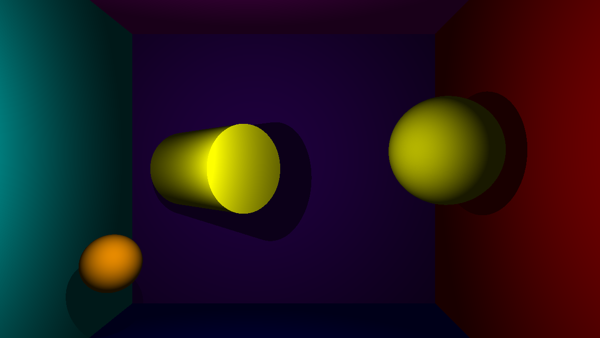
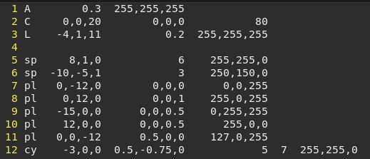
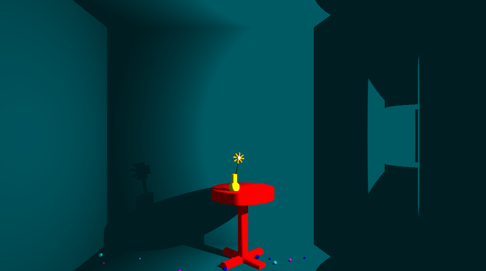
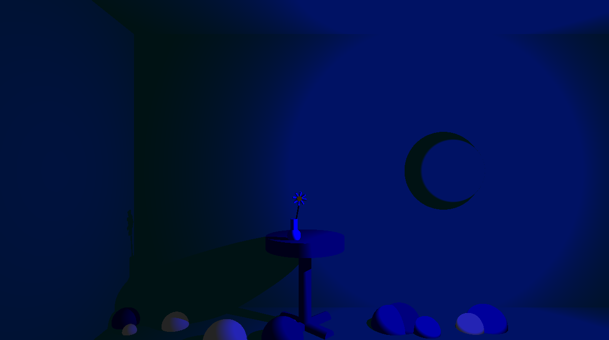
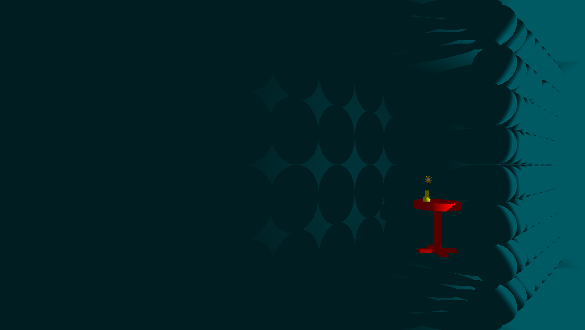

# 42_miniRT

Project in pair with [Waël Hazami](https://github.com/whazami).

<p align="left"> *************************** ENGLISH *************************** </p>

## The Project

### The objective of the program is to model images according to the raytracing protocol.

These images must represent a scene, seen from a defined angle and containing simple 
geometrical objects, each with objects, each with its own lighting system.

This project uses the MinilibX, the goal was to implement at least 3 simple geometric 
objects such as plane, sphere, Cylinder and to be able to apply transformations to objects,
lights and camera: translation and rotation.


### An example of a simple scene with multi-objects:



## Prerequisites
* A Unix-based operating system (only Linux)
* GCC compiler
* GNU Make

## How does it works
Clone the repository ``` git clone git@github.com:olelong/42_miniRT.git ```  
Enter in the repository ``` cd 42_miniRT ``` or the name you gave when you cloned the repository  
  
#### To launch the program you can :
Type the command ``` make ```
Launch the executable ``` ./minirt ``` followed by a .rt file like ```maps/home.rt```

Please note that the more complex the map is, the longer the loading time will be.

-> The .rt files are files that are used to configure scenes.
There are some examples of configuration files .rt in the map folder but you can configure your own.
(See how below)

#### To quit the scene you can :
Press the ESC key or click on the red cross in the window to close the window and exit
the program program properly.

## How to create a file .rt:
To create a config file, you need at least an ambient light A which contains information like its
type A, its brightness [0.0,1.0] and its color [0,255].
Then you can add other elements, that is :
##### - A camera C followed by its coordinates, its 3D orientation vector [-1,1] and its field of view.
##### - A light L followed by its coordinates, its luminosity [0.0,1.0], and its color [0,255].
- As many objects as you want it to be :
##### Cylinders cy :
Followed by its coordinates x,y,z, its orientation vector 3d [-1,1] for each axis x,y,z, 
its diameter,its height and its Color R,G,B [0,255].
##### Spheres sp :
Followed by its coordinates, diameter and color [0,255].
##### Planes pl :
Followed by its coordinates, its 3d orientation vector and its color [0,255].



## Other examples of maps :





## License

This project is licensed under the MIT License - see the [LICENSE](LICENSE) file for details.

</br>


<p align="left"> *************************** FRANCAIS *************************** </p>

## Le Projet

### L'objectif du programme est de modéliser des images selon le protocole de raytracing.

Ces images doivent représenter une scène, vue d'un angle défini et contenant de simples 
objets géométriques simples, chacun avec des objets et son propre système d'éclairage.

Ce projet utilise la MinilibX, le but étant d'implémenter au moins 3 objets géométriques simples 
objets tels que le plan, la sphère, le cylindre et d'être capable d'appliquer des transformations aux objets,
aux lumières et à la caméra : translation et rotation.


### Un exemple d'une scène simple avec multi-objets :
  


## Prérequis
* Un système d'exploitation basé sur Unix (seulement Linux, macOS)
* Un compilateur GCC
* Un GNU Make
  
## Comment cela fonctionne
Clonez le repository ``` git clone git@github.com:olelong/42_miniRT.git ```  
Entrez dans le dossier ``` cd 42_miniRT ``` ou le nom que vous avez donné lorsque vous avez cloné le repo  
  
#### Pour lancer le programme, vous pouvez :
Taper la commande ```make ```.
Lancer l'exécutable ```./minirt ``` suivi d'un fichier .rt comme ```maps/home.rt```.

Notez que plus la carte est complexe, plus le temps de chargement est long.

-> Les fichiers .rt sont des fichiers qui sont utilisés pour configurer les scènes.
Il y a quelques exemples de fichiers de configuration .rt dans le dossier map mais vous pouvez configurer les vôtres.
(Voir comment ci-dessous)

#### Pour quitter la scène, vous pouvez :
Appuyer sur la touche ESC ou cliquer sur la croix rouge dans la fenêtre pour fermer la fenêtre et quitter
le programme correctement.

## Comment créer un fichier .rt :
Pour créer un fichier de configuration, vous avez besoin au moins d'une lumière ambiante A qui contient des informations 
comme son type A, sa luminosité [0.0,1.0] et sa couleur [0,255].
Ensuite, vous pouvez ajouter d'autres éléments, à savoir :
##### - Une caméra C suivie de ses coordonnées, de son vecteur d'orientation 3D [-1,1] et de son champ de vision.
##### - Une lumière L suivie de ses coordonnées, sa luminosité [0.0,1.0], et sa couleur [0,255].
- Autant d'objets que vous le souhaitez :
##### Cylindres cy :
Suivi de ses coordonnées x,y,z, de son vecteur d'orientation 3d [-1,1] pour chaque axe x,y,z, 
son diamètre, sa hauteur et sa couleur R,G,B [0,255].
##### Sphères sp :
Suivie de ses coordonnées, de son diamètre et de sa couleur [0,255].
##### PLans pl :
Suivi de ses coordonnées, de son vecteur d'orientation 3d et de sa couleur [0,255].


## Licence

Ce projet est sous licence MIT - voir le fichier [LICENSE](LICENSE) pour plus de détails.
